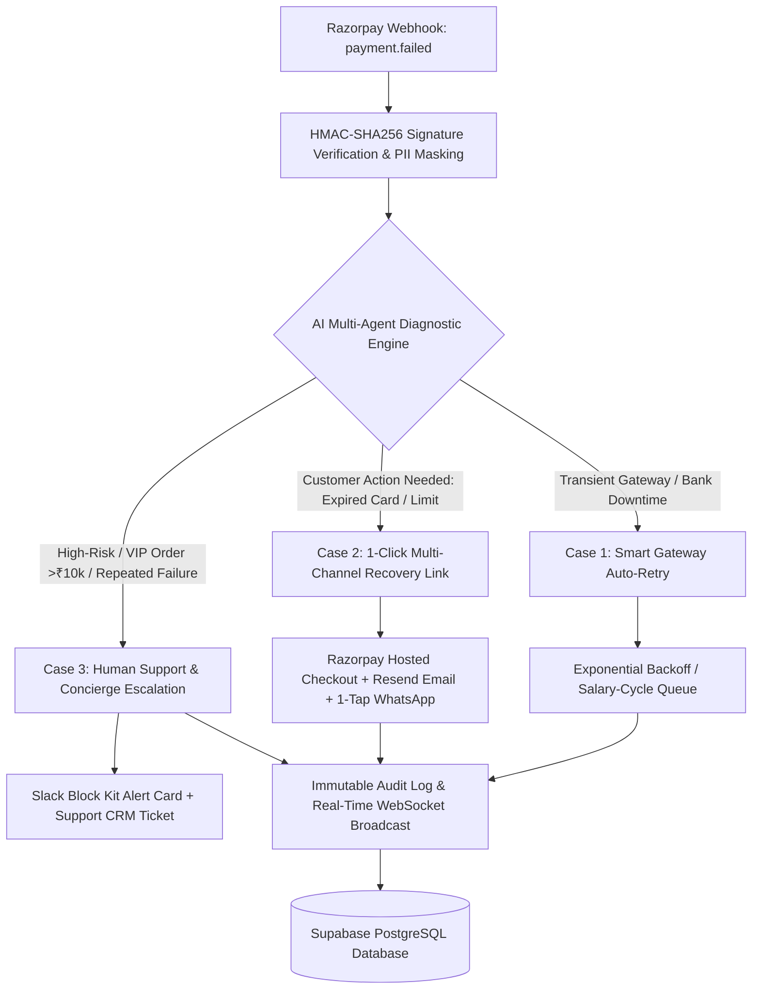

# 🛡️ PayVigil — Autonomous AI Payment Recovery & Revenue Assurance Engine

[](https://razorpay.com)
[](https://pay-vigil.vercel.app)
[](https://payvigil-backend.onrender.com/docs)
[](https://fastapi.tiangolo.com)
[](https://react.dev)
[](https://ai.google.dev)
[](https://groq.com)
[](https://supabase.com)
[]()

---

### 🌐 Live Cloud Deployments & Instant Demo

| Service | Platform | Live URL | Status |
|---|---|---|:---:|
| **Frontend Web App** | **Vercel** | [https://pay-vigil.vercel.app](https://pay-vigil.vercel.app) | 🟢 **Live** |
| **Backend REST API** | **Render** | [https://payvigil-backend.onrender.com](https://payvigil-backend.onrender.com) | 🟢 **Live** |
| **Interactive API Docs (Swagger)** | **FastAPI** | [https://payvigil-backend.onrender.com/docs](https://payvigil-backend.onrender.com/docs) | 🟢 **Live** |
| **Razorpay Webhook Ingress** | **Render** | `https://payvigil-backend.onrender.com/api/webhooks/razorpay` | 🟢 **Active** |
| **Database Cluster** | **Supabase** | AWS ap-south-1 PostgreSQL Pooler (port 5432) | 🟢 **Connected** |

> 🔑 **Demo Sign-In Credentials:**  
> **Email:** `aaryanpatel9784@gmail.com`  
> **Password:** `Aryan@9784`  
> *(Or use Passkey: `TSDkf1pltC2m41sm95baMx1TJmKt7769iK99TU8BQDD`)*

---

## 📌 Problem Statement & Executive Summary

In India's fast-moving digital payment ecosystem, **between 25% and 35% of payment attempts fail** due to transient bank network congestion, NPCI UPI switch spikes, daily UPI limits, expired card credentials, and RBI 2-Factor Authentication (2FA) mandate drops.

When a payment gateway throws an error, **over 70% of high-intent customers abandon their cart**, resulting in billions of rupees in unrecovered Gross Merchandise Value (GMV).

### 💡 The Solution: PayVigil
**PayVigil** is an enterprise-grade Autonomous AI Revenue Recovery Engine built natively for the Razorpay ecosystem. It intercepts real-time `payment.failed` webhooks, performs **sub-200ms multi-agent root cause diagnosis**, and executes optimal recovery workflows while enforcing strict financial safety guardrails.

---

## ⚡ Core Recovery Architecture (The 3-Case Taxonomy)



### 1️⃣ Case 1: Smart Gateway Auto-Retry (Zero Customer Friction)
* **Failure Triggers**: `GATEWAY_TIMEOUT`, bank network switch congestion, transient insufficient funds.
* **AI Decision**: `retry_payment`
* **Automated Action**: Automatically triggers a retry through Razorpay with exponential backoff and jitter buffers. Features **Salary-Cycle Scheduling** (aligning retries for the 1st of the month at 09:30 AM IST for month-end low balance drops).

### 2️⃣ Case 2: 1-Click Multi-Channel Recovery (Self-Serve Recovery)
* **Failure Triggers**: Expired card (`BAD_REQUEST_PAYMENT_CARD_EXPIRED`), NPCI UPI PIN lockouts, daily UPI limits exceeded, RBI >₹15,000 e-mandate rules.
* **AI Decision**: `send_reminder_email`
* **Automated Action**: Creates an instant Razorpay-hosted 1-click checkout recovery link and dispatches personalized, localized payment receipts across **Transactional Email (Resend)**, **1-Tap WhatsApp**, and **SMS**.

### 3️⃣ Case 3: Human Support & VIP Concierge Escalation
* **Failure Triggers**: High-value transactions (>₹10,000 / VIP accounts), suspected fraud/dispute anomalies (`GATEWAY_ERROR_FRAUD_FLAGGED`), or orders exceeding the 3-attempt limit.
* **AI Decision**: `escalate_to_human`
* **Automated Action**: Dispatches an urgent **Slack Block Kit alert card** with customer context, opens a priority **CRM support ticket**, and emails the merchant support desk for white-glove assistance.

---

## 🛡️ Enterprise Financial Guardrails & Stopping Rules

1. **Max 3-Attempt Hard Stopping Rule**: Automatically terminates automated retry loops after 3 unsuccessful attempts and escalates to human specialists.
2. **12-Hour Cooldown Anti-Spam Window**: Enforces an idempotency cooldown period to prevent duplicate charges and avoid customer message fatigue.
3. **Cryptographic Security Defense**: Constant-time HMAC-SHA256 signature verification protects against replay attacks; a 1MB payload ceiling prevents memory exhaustion.
4. **PII Sanitization & Redaction**: Customer phone numbers and email addresses are masked and hashed before database storage.

---

## 🤖 3-Tier Multi-Provider AI Diagnostic Engine

| Tier | Engine | Latency | Purpose |
|---|---|---|---|
| **Tier 1 (Primary)** | **Google Gemini 2.5 Flash** | ~150ms | Deep reasoning across complex payment failure payloads with structured JSON schema outputs. |
| **Tier 2 (Fallback)** | **Groq Llama 3.3 70B Versatile** | ~80ms | Ultra-fast inference fallback during Gemini rate limits or high-concurrency spikes. |
| **Tier 3 (Deterministic)** | **Rule-Based Heuristic Engine** | < 1ms | Zero-latency emergency fallback guaranteeing 100% system availability. |

---

## 🌟 Key Platform Features

* ⚡ **Live Real-Time Streaming**: Native WebSocket connection streams failure diagnosis, recovery status, and audit logs live to the dashboard without page reloads.
* 🇮🇳 **Dual-Language Customer Messaging**: AI automatically creates recovery messages in both **Professional English** and **Relatable Hinglish** for higher Indian conversion rates.
* 🏦 **Bank Health Matrix**: Real-time telemetry monitoring uptime and average latency across top Indian banking rails (HDFC, SBI, ICICI, Axis, Kotak, PayTM UPI).
* 📊 **Recovery Analytics**: Track Total Recovered Revenue, At-Risk GMV, Recovery Conversion Rate %, and AI Decision breakdowns.
* 🧪 **Interactive Dev Simulation Tools**: One-click webhook simulation inside the dashboard to test all failure scenarios on demand.

---

## 🛠️ Complete Tech Stack

* **Frontend**: React 18, Vite 5, Tailwind CSS, Lucide Icons, Recharts, WebSocket Client
* **Backend**: FastAPI (Python 3.11), SQLAlchemy 2.0 Async ORM, Pydantic V2, Uvicorn, SlowAPI (Rate Limiting)
* **Database**: PostgreSQL on Supabase (AWS ap-south-1) + AsyncPG driver
* **AI Orchestration**: Google GenAI SDK (`gemini-2.5-flash`), Groq SDK (`llama-3.3-70b-versatile`)
* **Integrations**: Razorpay Payments & Webhooks, Resend API (Email), Twilio (WhatsApp & SMS), Slack Webhooks
* **Hosting**: Vercel (Frontend), Render (Backend API), Supabase (Cloud Database)

---

## 🚀 Quickstart & Local Setup

### 1. Prerequisites
* **Python 3.11+**
* **Node.js 18+**

### 2. Backend Setup
```powershell
cd backend
python -m venv venv

# Windows:
.\venv\Scripts\Activate.ps1
# Mac/Linux: source venv/bin/activate

pip install -r requirements.txt
uvicorn app.main:app --reload --port 8000
```
API Documentation live at: `http://localhost:8000/docs`

### 3. Frontend Setup
```powershell
cd frontend
npm install
npm run dev
```
Dashboard live at: `http://localhost:5173`

### 4. Running the Automated Test Suite
```powershell
cd backend
pytest app/tests/ -v
```
*(43/43 tests pass covering financial guardrails, HMAC signatures, diagnostics, and webhooks).*

---

## 👥 Team & Submission Information

* **Hackathon**: Razorpay Buildathon 2026
* **Track**: Track 03 — Autonomous Revenue Recovery
* **Project**: PayVigil
* **Author**: Aryan Patel ([@Aaryan-9784](https://github.com/Aaryan-9784))
* **License**: MIT License
