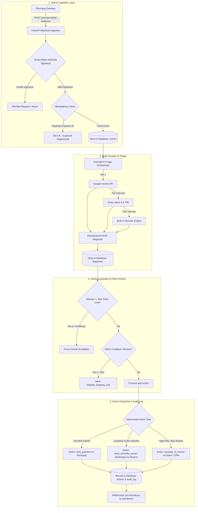

<div align="center">

# 🛡️ PayVigil

### Autonomous AI Payment Recovery & Revenue Assurance Engine for Razorpay

**An enterprise-grade, real-time payment failure triage and autonomous revenue recovery pipeline powered by Multi-Provider AI Orchestration (Google Gemini / Groq Cloud / Built-in Heuristics), Dynamic Financial Guardrails, and Full Role-Based Access Control.**

<br />

[](https://fastapi.tiangolo.com)
[](https://reactjs.org/)
[](https://vitejs.dev/)
[](https://tailwindcss.com/)
[](https://www.python.org/)
[](https://aistudio.google.com/)
[](https://groq.com/)
[](https://razorpay.com/)
[]()
[](LICENSE)

<br />

[Executive Summary](#-executive-summary) • [Problem & ROI](#-the-problem--the-payvigil-solution) • [Key Pillars](#-core-technical-pillars) • [System Architecture](#-system-architecture) • [24 Scenarios](#-24-calibrated-failure-recovery-scenarios) • [Guardrails](#-financial-guardrails--stopping-rules) • [Quick Start](#-quick-start-guide-step-by-step) • [API & cURL](#-api-reference--quick-curl-examples) • [Security & RBAC](#-security-data-protection--rbac) • [Contributing](CONTRIBUTING.md) • [License](LICENSE)

</div>

---

## 📖 Executive Summary

In digital commerce and subscription billing, **failed payments account for 9% to 14% of lost Gross Merchandise Value (GMV)**. While a small fraction represents permanent fraud or deliberate cancellation, the vast majority are recoverable friction: transient issuing bank timeouts, momentary low balance, expired card updates, 3DS authentication drops, NPCI daily transfer limits, or UPI PIN locks.

**PayVigil** acts as an autonomous intelligent intermediary between your **Razorpay Gateway** and your customers. It intercepts raw `payment.failed` webhooks in real time, diagnoses root causes in milliseconds across a 3-tier AI cascade (Google Gemini $\rightarrow$ Groq Cloud $\rightarrow$ Offline Heuristics), and executes precise automated recovery actions (smart retries, bilingual recovery emails/SMS in English and Hinglish, and human escalations) while strictly enforcing enterprise financial guardrails.

---

## 🎯 The Problem & The PayVigil Solution

```
  TRADITIONAL GATEWAY EXPERIENCE:
  [Customer Checkout] ──► [Payment Fails] ──► [Generic Error Code] ──► [Customer Abandons Cart] ──► ❌ 14% GMV Lost
  
  PAYVIGIL AUTONOMOUS PIPELINE:
  [Customer Checkout] ──► [Payment Fails] ──► [PayVigil AI Triage] ──► [Smart Retry / 1-Click Link] ──► ✅ Revenue Recovered!
```

### 📊 Comparative Analysis

| Dimension | Traditional Gateway Behavior | PayVigil Autonomous Pipeline |
| :--- | :--- | :--- |
| **Error Handling** | Generic, cryptic error codes shown to confused buyers | **Multi-Model AI Diagnosis**: Identifies exact cause across 24 failure categories |
| **Retry Strategy** | Blind, repeated retries that trigger card fraud locks | **Smart Retries & Guardrails**: 3-retry cap, exponential backoff & 12h cooldown |
| **Customer Recovery** | English-only technical emails or no follow-up at all | **Bilingual Omni-Channel Nudges**: English & Hinglish via Email, WhatsApp & SMS |
| **Merchant Visibility** | Batch reports days later with no live intervention | **Live Real-Time Dashboard**: WebSocket telemetry, ₹ Recovered & ₹ At-Risk KPIs |
| **Security & Privacy** | Plaintext logs and vulnerable webhook endpoints | **Zero-Trust Infrastructure**: HMAC-SHA256 signatures & AES-128 PII encryption |

---

## ⚡ Core Technical Pillars

```
┌─────────────────────────────────────────────────────────────────────────────────────────────────┐
│                                       PAYVIGIL PLATFORM                                         │
├───────────────────────────────┬─────────────────────────────────┬───────────────────────────────┤
│    1. ZERO-TRUST INGESTION    │    2. MULTI-TIER AI TRIAGE      │   3. FINANCIAL GUARDRAILS     │
│  • HMAC-SHA256 Signatures     │  • Google Gemini 2.5 Flash      │  • Max 3-Retry Ceiling        │
│  • Anti-Replay Timestamps     │  • Groq Llama-3.3-70B           │  • 12-Hour Cooldown Window    │
│  • Payment Idempotency        │  • Offline Heuristics Fallback  │  • Rate Limiting & Throttling │
├───────────────────────────────┼─────────────────────────────────┼───────────────────────────────┤
│   4. BILINGUAL RECOVERY       │    5. DATA PROTECTION (PII)     │   6. REAL-TIME DASHBOARD      │
│  • Contextual English Nudges  │  • AES-128-CBC Field Encryption │  • Live WebSocket Telemetry   │
│  • Native Hinglish Messages   │  • PBKDF2 Password Hashing      │  • Recovered & At-Risk KPIs   │
│  • 1-Click Hosted Checkout    │  • PCI-DSS / RBI Display Masking│  • Searchable Audit Trail     │
└───────────────────────────────┴─────────────────────────────────┴───────────────────────────────┘
```

---

## 🏗️ System Architecture



---

## 📋 24 Calibrated Failure Recovery Scenarios

<details open>
<summary><b>💳 Track A: Core Card & Banking Degradations (6 Scenarios)</b></summary>
<br />

| Scenario | Error Code | Root Cause | Automated Action |
| :--- | :--- | :--- | :--- |
| **1. Low Balance** | `BAD_REQUEST_PAYMENT_FAILED` | Temporary low funds in account | `retry_payment` (Scheduled retry) |
| **2. Expired Card** | `BAD_REQUEST_PAYMENT_CARD_EXPIRED` | Card expiration passed | `send_reminder_email` (Card update link) |
| **3. Bank Timeout** | `GATEWAY_TIMEOUT` | Bank 2FA server latency | `retry_payment` (Auto-retry after buffer) |
| **4. 3DS Auth Drop** | `BAD_REQUEST_PAYMENT_OTP_INCORRECT`| 3DS OTP incorrect/dropped | `send_reminder_email` (1-click checkout link) |
| **5. Card Online Toggle** | `CARD_TRANSACTION_NOT_ENABLED` | RBI online card toggle off | `send_reminder_email` (Bank app enablement guide) |
| **6. NRI Multi-Currency** | `INTERNATIONAL_CARD_CURRENCY_MISMATCH`| Foreign currency block | `send_reminder_email` (Multi-currency checkout) |

</details>

<details open>
<summary><b>🇮🇳 Track B: Indian Payment Ecosystem & UPI (6 Scenarios)</b></summary>
<br />

| Scenario | Error Code | Root Cause | Automated Action |
| :--- | :--- | :--- | :--- |
| **7. UPI PIN Locked** | `UPI_PIN_ATTEMPTS_EXCEEDED` | 24-hour UPI PIN lockout | `send_reminder_email` (Switch to Card/NetBanking link) |
| **8. NPCI Daily Cap** | `NPCI_DAILY_TRANSACTION_LIMIT` | Bank UPI daily limit hit | `send_reminder_email` (Switch to NetBanking link) |
| **9. RuPay Credit Limit**| `RUPAY_UPI_CREDIT_LIMIT_EXCEEDED`| Credit-on-UPI limit exceeded | `send_reminder_email` (Switch to standard payment link) |
| **10. COD-to-Prepaid** | `COD_ORDER_VERIFICATION_PENDING` | Unverified COD order | `send_reminder_email` (Prepaid discount recovery link) |
| **11. RBI >₹15k AFA** | `RBI_AFA_MANDATE_OVER_15K` | Additional auth requirement | `send_reminder_email` (1-Tap OTP approval link) |
| **12. Webview Escape** | `IN_APP_BROWSER_AUTH_DEADLOCK` | In-app browser deadlock | `send_reminder_email` (Direct browser / QR link) |

</details>

<details open>
<summary><b>🔄 Track C: Subscriptions, B2B & High-Ticket (6 Scenarios)</b></summary>
<br />

| Scenario | Error Code | Root Cause | Automated Action |
| :--- | :--- | :--- | :--- |
| **13. e-Mandate Debit** | `SUBSCRIPTION_MANDATE_DEBIT_FAILED`| Recurring mandate network drop| `retry_payment` (Re-attempt mandate cycle) |
| **14. B2B Invoice** | `B2B_INVOICE_PAYMENT_OVERDUE` | Net-30 invoice overdue | `send_reminder_email` (Invoice payment portal) |
| **15. Salary Cycle** | `INSUFFICIENT_FUNDS_MONTH_END` | Month-end salary gap | `retry_payment` (Scheduled for 1st of month) |
| **16. VIP High-Ticket** | `VIP_ORDER_PAYMENT_FAILED` | High-value order dropped | `escalate_to_human` (VIP concierge recovery) |
| **17. EdTech EMI Drop** | `EDUCATION_LOAN_EMI_BOUNCE` | Student loan EMI bounce | `send_reminder_email` (NACH re-consent link) |
| **18. SaaS Churn Shield**| `SAAS_TOKEN_EXPIRED_CHURN` | Card token expired | `send_reminder_email` (1-Tap token renewal link) |

</details>

<details open>
<summary><b>⚡ Track D: Real-Time Checkout & Fraud Safety (6 Scenarios)</b></summary>
<br />

| Scenario | Error Code | Root Cause | Automated Action |
| :--- | :--- | :--- | :--- |
| **19. Flash Sale Spike** | `FLASH_SALE_GATEWAY_THROTTLE` | Traffic switch congestion | `retry_payment` (Jittered exponential backoff) |
| **20. Quick-Commerce** | `QUICK_COMMERCE_CART_ABANDONED` | Fast delivery checkout drop | `send_reminder_email` (Instant UPI Lite / QR link) |
| **21. Travel Price-Lock**| `AIRLINE_FARE_LOCK_EXPIRED` | Flight booking session drop | `send_reminder_email` (15-min seat reservation link) |
| **22. Abandoned Cart** | `CHECKOUT_SESSION_ABANDONED` | Final OTP step drop-off | `send_reminder_email` (1-click cart recovery link) |
| **23. Suspected Fraud** | `GATEWAY_ERROR_FRAUD_FLAGGED` | Risk engine anomaly | `escalate_to_human` (Immediate risk hold) |
| **24. Chargeback Dispute**| `PAYMENT_DISPUTE_RAISED` | Customer dispute raised | `escalate_to_human` (Support specialist ticket) |

</details>

---

## 🛡️ Financial Guardrails & Stopping Rules

```
  Incoming Failure Webhook
            │
            ▼
    [Attempt >= 3?] ──────► YES ──────► [Force Human Escalation] (Protects card from bank locks)
            │ NO
            ▼
    [Within 12h Cooldown?] ─► YES ────► [Suppress & Log as 'skipped_stopping_rule'] (Prevents throttles)
            │ NO
            ▼
    [Execute Safe Action] (Smart Retry / Bilingual Recovery Email / WhatsApp)
```

1. **Max Retry Ceiling (`MAX_RETRY_ATTEMPTS = 3`)**:
   - Caps repeated gateway retries to protect customer cards from fraud blocks, issuing bank locks, and merchant penalties.
   - Once total attempts reach the threshold, the transaction automatically transitions to human escalation.

2. **Cooldown Throttle (`RETRY_COOLDOWN_HOURS = 12` / `15m`)**:
   - Prevents aggressive retry bursts that degrade user experience and trigger gateway throttling.
   - Incoming failures inside the cooldown window are logged as `skipped_stopping_rule`.

3. **Cryptographic HMAC Verification**:
   - Uses `hmac.compare_digest` on the raw request byte stream against `RAZORPAY_WEBHOOK_SECRET` to prevent timing and tampering attacks.

---

## 🚀 Quick Start Guide (Step-by-Step)

### 📋 Prerequisites
- **Python**: `3.10` or higher
- **Node.js**: `18.x` or higher (`npm`)
- **Git**

---

### Step 1: Start the Backend (FastAPI)

```bash
# 1. Navigate to the backend directory
cd backend

# 2. Activate virtual environment
# Windows (PowerShell):
.\venv\Scripts\Activate.ps1
# macOS / Linux:
source venv/bin/activate

# 3. Start the FastAPI server
uvicorn app.main:app --reload --port 8000
```

- **Backend API**: `http://localhost:8000`
- **Interactive Swagger Docs**: [http://localhost:8000/docs](http://localhost:8000/docs)
- **ReDoc Documentation**: [http://localhost:8000/redoc](http://localhost:8000/redoc)

---

### Step 2: Start the Frontend (React + Vite)

```bash
# 1. Open a new terminal and navigate to frontend
cd frontend

# 2. Install dependencies (first time only)
npm install

# 3. Start the Vite development server
npm run dev
```

- **Dashboard UI**: Open **[http://localhost:5173](http://localhost:5173)** in your browser.

---

### Step 3: Start Cloudflare Webhook Tunnel *(Optional for Live Razorpay Webhooks)*

```bash
# In the project root directory:
.\cloudflared.exe tunnel --url http://localhost:8000
```

1. Copy the generated public HTTPS URL (e.g. `https://xxxx.trycloudflare.com`).
2. In your **Razorpay Dashboard** $\rightarrow$ **Settings** $\rightarrow$ **Webhooks** $\rightarrow$ **Add New Webhook**:
   - **Webhook URL**: `https://xxxx.trycloudflare.com/api/webhooks/razorpay`
   - **Secret**: Enter your `RAZORPAY_WEBHOOK_SECRET` (matching `backend/.env`).
   - **Active Events**: Select `payment.failed`.

---

## 📡 API Reference & Quick cURL Examples

### 🔍 1. System Health Check
```bash
curl -X GET http://localhost:8000/health
```

### 🔑 2. User Authentication
```bash
curl -X POST http://localhost:8000/api/auth/login \
  -H "Content-Type: application/json" \
  -d '{"email": "aaryanpatel9784@gmail.com", "password": "your_password"}'
```

### ⚡ 3. Real-Time Telemetry & Metrics
```bash
curl -X GET http://localhost:8000/api/dashboard \
  -H "x-api-key: payvigil-secure-dashboard-api-key-2026"
```

### 📦 Endpoints Summary Table

| Method | Endpoint | Auth | Description |
| :--- | :--- | :---: | :--- |
| `POST` | `/api/webhooks/razorpay` | HMAC Signature | Receives raw `payment.failed` webhook payloads with HMAC verification |
| `POST` | `/api/auth/login` | Public | Authenticates with Email & Password, returns JWT token and role |
| `POST` | `/api/auth/signup` | Public | Registers new user (assigned `support` role by default) |
| `POST` | `/api/auth/forgot-password` | Public | Initiates password reset and generates 6-digit OTP code |
| `POST` | `/api/auth/verify-reset-code` | Public | Validates 6-digit OTP code against 15-minute expiry |
| `POST` | `/api/auth/reset-password` | Public | Updates password using validated OTP code |
| `POST` | `/api/auth/change-password` | Bearer Token | Updates authenticated user password |
| `GET` | `/api/auth/me` | Bearer Token | Fetches current user profile and role |
| `GET` | `/api/dashboard` | API Key / Token | Aggregated recovery KPIs (Total Recovered, At Risk, Success Rate) |
| `GET` | `/health` | Public | System health and AI provider availability status |
| `DELETE`| `/api/dev/reset-data` | Admin Passkey | Admin passkey-protected audit log purge endpoint |
| `WS` | `/ws/live` | WebSocket | WebSocket connection for real-time live event streaming |

---

## 🔐 Security, Data Protection & RBAC

| Security Layer | Implementation Mechanism | Compliance / Standard |
| :--- | :--- | :--- |
| **Ingestion Authentication** | HMAC-SHA256 byte-stream validation | Razorpay Webhook Standard |
| **PII Data Protection** | AES-128-CBC encryption at rest (`enc::`) | RBI / GDPR Data Privacy |
| **Credential Security** | PBKDF2-HMAC-SHA256 (100,000 rounds) | OWASP Password Storage |
| **Display Masking** | Masked emails (`a***l@domain.com`) & phones | PCI-DSS Data Handling |
| **Access Control (RBAC)** | Role-governed JWT tokens (`admin`, `support`) | Principle of Least Privilege |

### Roles & Access Matrix:
- **🛡️ System Administrator (`admin`)**: Full access to recovery telemetry, system configuration, developer simulation tools, and passkey-protected log purge.
- **🎧 Customer Support Specialist (`support`)**: Real-time triage inspection, 1-click customer WhatsApp/Email recovery outreach, and live audit tracking.

---

## 🧪 Testing & Quality Assurance

```bash
cd backend
.\venv\Scripts\pytest -v
```

### Complete Test Suite (43 / 43 Passed - 100% Pass Rate):
- ✅ `test_all_scenarios_validation.py` (24 Tests): Validates end-to-end recovery decisions across all 24 failure categories.
- ✅ `test_auth_rbac_and_forgot_password.py` (10 Tests): Validates Email/Password login, Sign Up role default (`support`), 3-step OTP forgot password, passkey verification, and token authentication.
- ✅ `test_webhooks.py` (4 Tests): Validates HMAC-SHA256 signature verification, rejection of forged signatures, and payment idempotency deduplication.
- ✅ `test_executor.py` (3 Tests): Validates Max Retry limit transitions ($\ge 3$), 12h cooldown window suppression, and execution logging.
- ✅ `test_claude_agent.py` (1 Test): Validates AI diagnostic consistency and deterministic fallback logic.
- ✅ `test_pure_python_flow.py` (1 Test): Validates complete synchronous webhook-to-action dispatch cycle.

---

## 📄 License & Governance

- **License**: Licensed under the [MIT License](LICENSE).
- **Security Policy**: See [SECURITY.md](SECURITY.md) for vulnerability disclosure protocols.
- **Contributing**: See [CONTRIBUTING.md](CONTRIBUTING.md) for developer guidelines and PR process.

<div align="center">
  <sub>Built with ❤️ for intelligent, autonomous fintech workflows at Razorpay Buildathon '26.</sub>
</div>
